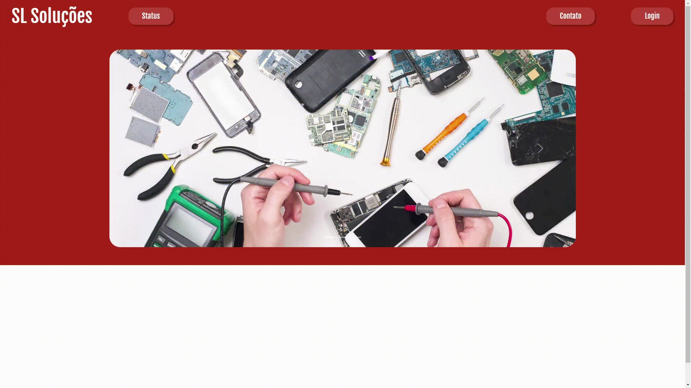
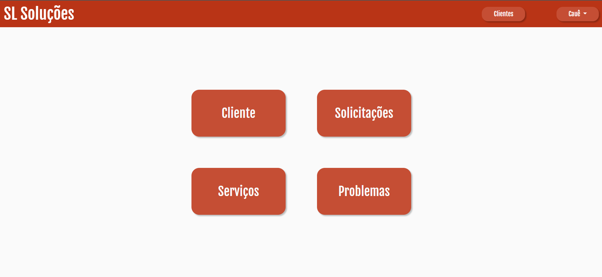

<h1 align=center> SL SOLUÇÕES 🖥🔧</h1>
<h4>O objetivo é desenvolver uma plataforma WEB para gestão de uma loja de informática especializada em conserto de equipamentos. </h4>
<h5>&nbsp &nbsp &nbsp 🟢 O sistema possui CRUD de clientes e problemas, além do gerenciamento de solicitaões e serviços iniciados.</h5>
<h5>&nbsp &nbsp &nbsp 🟢 O gerente possui a opção de gerar relatórios e verificar possíveis bonificações para os funcionários.</h5>
<h5>&nbsp &nbsp &nbsp 🟢 Os clientes podem consultar o status de suas solicitações a partir de um código recebido por email.</h5>

 

<h4>The goal is to develop a WEB plataform for managing a equipment maintenance store. </h4>
<h5>&nbsp &nbsp &nbsp 🟢 The website contains Client and Problemas CRUD, and also provides the management of requests and initialized services.</h5>
<h5>&nbsp &nbsp &nbsp 🟢 Manager has the option to obtain reports and verify salary bonus to the employees.</h5>
<h5>&nbsp &nbsp &nbsp 🟢 Clients can follow the status of their request by inserting a code received by email.</h5>

 

<h1 align=center> TECHNOLOGIES 💻</h1>

 

<h3 align=center>HTML &nbsp &nbsp CSS &nbsp &nbsp BOOTSTRAP  &nbsp &nbsp JQUERY  &nbsp &nbsp PHP &nbsp &nbsp LARAVEL &nbsp &nbsp LIVEWIRE </h3>

 

<h1 align=center> Home Page </h1>

 
    

<h1 align=center> Logged in Main Page </h1>

 
    

<h1 align=center> CRUD Client  </h1>

<h4 align=center> Problems, Requests and Services follow the same idea </h4>

 
    
    

<h1 align=center> Services </h1>

 
    

